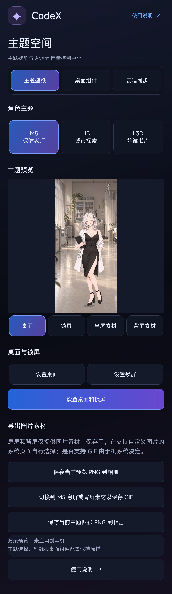
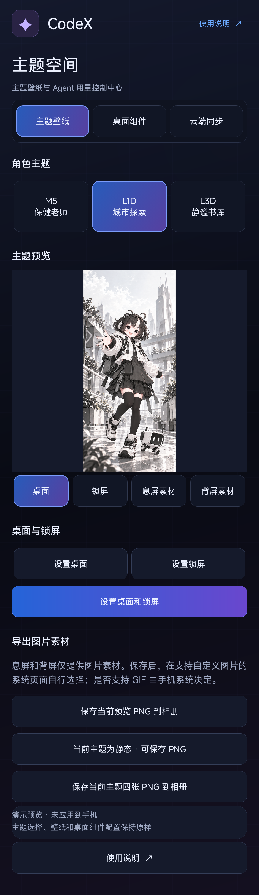
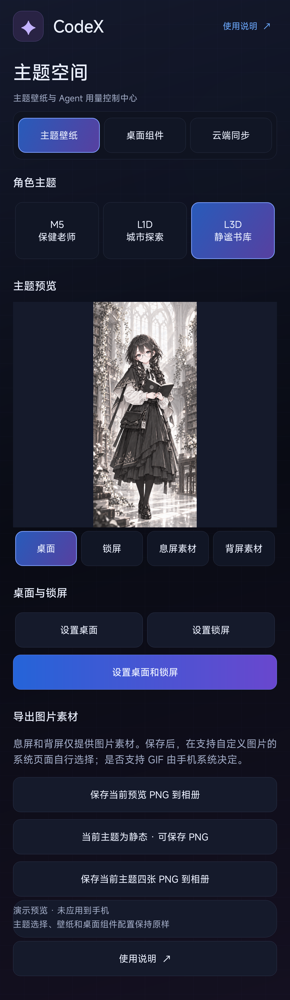
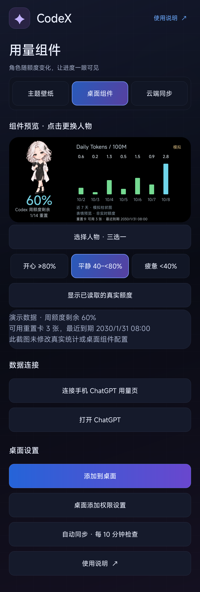
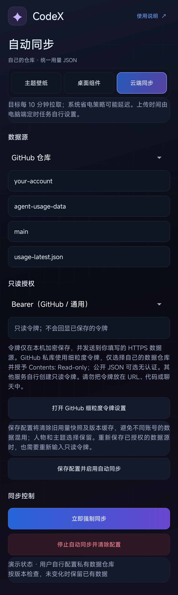

# xiaomi(android)_agent用量监测+壁纸一体化APP

CodeX 是面向 Android 11+ 的角色壁纸与 Agent 用量桌面组件。三套主题、标准桌面组件和云同步使用 Android 公共接口；息屏与背屏提供 PNG / GIF 素材预览和导出，由你按手机支持的方式设置。

用量由你自己的 Codex、其他 Agent 或 LLM 生成统一 JSON，推送到你自己的 Git 仓库，再由手机自动拉取。App 不内置个人统计仓库或访问令牌，也不会执行从仓库下载的代码。统计 JSON 是唯一的远端输入。

**下载 [v0.29.0 APK 与校验文件](https://github.com/jsczymm1015/xiaomi-android-agent-usage-wallpaper/releases/tag/v0.29.0)** · [一步步使用](docs/USAGE.md) · [创建自己的统计仓库](docs/REPOSITORY_SETUP.md) · [定时任务提示词 TXT](prompts/scheduled-usage-task.txt)

## 主要功能

| 功能 | 说明 |
| --- | --- |
| 主题壁纸 | M5、城市探索、静谧书库三套主题；M5 支持标准 Android 动态壁纸，另外两套为静态壁纸。 |
| 息屏 / 背屏素材 | 三套主题可导出 PNG；M5 的息屏 / 背屏素材另可导出循环 GIF。是否能设为系统息屏、背屏及是否支持 GIF，由具体手机决定。 |
| 用量桌面组件 | 显示额度剩余、统计窗口、Token 日用量、数据来源、可用重置卡数量与最近到期时间；未知数据明确显示未知。 |
| 自配数据源 | GitHub 仓库模式，或任意受支持服务的 HTTPS 原始 JSON 地址；支持无认证、Bearer、GitLab `PRIVATE-TOKEN`、Gitea `token`。 |
| 自动拉取 | APK 内含自动拉取实现；启用后目标为每轮结束约 10 分钟再次检查，后台调度可能被系统延迟。可手动强制同步。 |
| 电脑工具与提示词 | APK 提供离线工具包导出，内含统一格式校验、Git 发布脚本与定时任务提示词。工具在你自己的电脑执行。 |

最低 Android 11。基础功能不依赖澎湃 OS；目前的真机验证仍来自小米设备，不能把标准接口兼容设计等同于全部安卓机型实测。详见 [兼容性与测试边界](docs/COMPATIBILITY.md)。

## 界面预览

以下截图使用演示数据，不包含真实统计或令牌。截图版本及重新生成方法见 [截图说明](docs/SCREENSHOTS.md)。

### 主题壁纸

| M5 · 保健老师 | L1D · 城市探索 | L3D · 静谧书库 |
| --- | --- | --- |
|  |  |  |

### 桌面组件与云端同步

| 用量组件 | 用户自配云同步 |
| --- | --- |
|  |  |

## 快速开始

1. 从 [Release](https://github.com/jsczymm1015/xiaomi-android-agent-usage-wallpaper/releases/tag/v0.29.0) 下载 APK，按手机提示允许安装此来源的应用。
2. 按 [建库说明](docs/REPOSITORY_SETUP.md) 创建自己的私有统计仓库；公开的 App 源码仓库不用于存放个人数据。
3. 在 App“使用说明”点击“导出部署工具与定时任务提示词”，或克隆本仓库。在电脑上准备 Python 3.10+、Git 和正常登录的 Agent。
4. 把 [定时任务提示词](prompts/scheduled-usage-task.txt) 中的路径和数据源替换成自己的配置，先手动生成、校验并推送一次统计，再按自己的授权配置计划任务。
5. 在 App 的云同步页面填写自己的仓库或 HTTPS 原始 JSON 地址；需要认证时，仅在手机填写只读授权，然后保存并同步。
6. 在组件页面选择人物并添加到桌面；息屏、背屏需要时导出素材，再在系统支持的位置手动设置。

完整步骤、不同 Git 服务的地址示例、授权方式和故障排查见 [使用说明](docs/USAGE.md)。App 与 TXT 文件本身不会在电脑上创建计划任务。

## 统一统计格式

Codex 和其他 Agent 使用相同的 `schemaVersion: 1` JSON。通用来源为 `source: "agent_usage"`，`provider` 标明实际来源；额度必须保留 `weekly`、`daily`、`monthly` 等窗口，不把不同窗口冒充同一种额度。没有可信可读数据时填写 `null`，不能用模型猜测值补齐。

发布前运行：

```bash
python3 desktop/snapshot_schema.py /path/to/private/usage-latest.json
python3 desktop/publish_snapshot.py --repo-dir /path/to/your-stats-repo --input /path/to/private/usage-latest.json
```

上传程序使用该统计仓库现有的 Git 远端与本机凭据管理，不在 JSON、提示词或源码中保存访问令牌。不强推，不覆盖未解决的本地或远端冲突。字段、未知状态和日期语义见 [功能与格式说明](docs/FEATURES.md)。[合成格式示例](examples/usage-example.json) 只用于理解结构，不能当作个人真实统计上传。

## 开发与构建

环境：Python 3.10+、JDK 17+、Android Platform 35、Build Tools 35.0.0；USB 安装另需 Platform Tools。SDK 安装与许可证由你确认。

```bash
python3 scripts/package_setup.py
python3 scripts/run_tests.py
python3 scripts/build_android.py --check
python3 scripts/build_android.py
python3 scripts/install_android.py --serial YOUR_ADB_SERIAL
```

输出为 `build/CodeX.apk`。自行构建使用的密钥通常与官方 Release 不同，覆盖升级需要相同签名；不要为绕过签名冲突直接卸载已有 App。签名密钥、SDK 和本机数据不随源码发布。Mac 细节见 [开发主机说明](docs/MACOS.md)。

| 目录 | 内容 |
| --- | --- |
| `android/` | Android 界面、壁纸、素材、组件与自动拉取实现。 |
| `desktop/` | 用量读取、统一格式校验和用户自配 Git 仓库发布工具。 |
| `prompts/` | 可交给 Codex、其他 Agent 或 LLM 的定时任务提示词。 |
| `scripts/` | 构建、安装、测试与展示截图工具。 |
| `docs/` | 使用、建库、格式、兼容性及验证记录。 |

[功能与 JSON 格式](docs/FEATURES.md) · [兼容性](docs/COMPATIBILITY.md) · [验证记录](docs/VERIFICATION.md)
